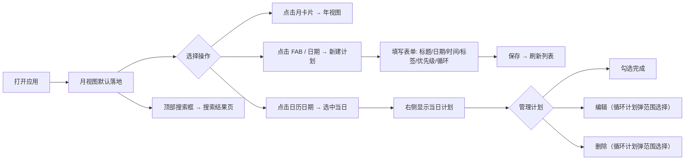

# 计划管理应用

一个支持按年 / 月 / 日三级视图浏览和管理个人日程计划的 Web 应用，移动端优先设计。

## 1. 项目背景

本项目基于 AI-Native SDLC 理念构建——从需求分析、技术设计、代码实现到文档生成，全程由 AI（Claude Code）深度参与，人负责决策和验收。核心问题是：个人日程管理工具普遍要么过重（日历应用）、要么过轻（备忘录），缺少一个既能纵览全年进度、又能精确管理某天时间段的轻量工具。

## 2. 技术栈

| 类型 | 技术 |
|---|---|
| 前端 | Umi 4 · React 18 · TypeScript · Ant Design 5 · Less · @dnd-kit/core |
| 后端 | Express 4 · TypeScript · zod · morgan |
| 数据存储 | SQLite（better-sqlite3，WAL 模式） |
| 测试 | vitest（单元 + 集成）· Playwright（E2E）· curl（手工接口验证） |
| 部署 | Docker Compose（生产）/ pnpm dev（本地开发） |
| AI 工具 | Claude Code（claude-sonnet-4-6） |

## 3. 核心功能

- **年视图**：12 个月卡片，展示每月计划完成数 / 总数及进度条，点击跳转月视图
- **月视图**：左侧日历 + 右侧当日计划列表（桌面），移动端切换为日期分组列表
- **日视图**：有时间段的计划渲染在时间轴上，无时间段计划列在全天区域，今天显示实时红线；时间块可直接拖拽移动（5 分钟吸附）
- **计划管理**：新建、编辑、删除、勾选完成，FAB 悬浮按钮 + 日期点击两种入口
- **优先级标识**：低 / 中 / 高三档，PlanCard 左侧色条可视化区分（低=紫粉，中=橙黄，高=红橙）
- **循环计划**：每天 / 每周 / 每月重复，提前批量生成实例，各实例完成状态独立；编辑 / 删除支持仅此条 / 此条及之后 / 全部三种范围
- **搜索**：顶部搜索框输入关键词，结果页按日期分组展示，支持编辑 / 删除 / 勾选
- **标签系统**：5 个预置标签，支持自定义添加（最多 20 字符）
- **错误处理**：请求拦截器统一弹错误提示，所有操作按钮有 loading 状态防重复提交
- **移动端适配**：768px 断点响应式，表单 Modal 全屏，FAB 适配 iOS 安全区域

## 4. 核心流程



## 5. 本地启动

```bash
# 后端（端口 3001）
cd server
nvm use 20
pnpm install
pnpm dev

# 前端（新终端，端口 8000）
cd client
nvm use 20
pnpm install
pnpm dev
```

浏览器访问 http://localhost:8000

## 6. 测试执行

```bash
# 后端自动化测试（先停止 dev server）
cd server && pnpm install && pnpm test

# 验证后端接口（后端启动后）
curl "http://127.0.0.1:3001/api/tags"
curl "http://127.0.0.1:3001/api/plans?view=month&date=2026-06"

# 搜索接口
curl "http://127.0.0.1:3001/api/plans?view=search&q=会议"

# 新建循环计划（每周一三五）
curl -X POST http://127.0.0.1:3001/api/plans \
  -H "Content-Type: application/json" \
  -d '{"title":"晨跑","date":"2026-07-01","tags":["健身"],"done":false,"priority":2,"recurrence_type":"weekly","recurrence_days":[1,3,5],"recurrence_end_date":"2026-09-30"}'

# 前端 E2E（前后端均启动后）
cd client && pnpm install && npx playwright install chromium
pnpm test:e2e        # 有头模式（可见浏览器）
pnpm test:e2e:ui     # Playwright UI 调试模式
```

## 7. 演示路径

1. 访问 http://localhost:8000，自动跳转月视图
2. 点击右下角 **+** 按钮新建计划（填写标题、日期、时间段、标签、优先级）
3. 创建一个每周循环计划，观察日历上多天出现点标记
4. 点击日历上的日期，右侧列表刷新；点击顶部「日」进入日视图
5. 在日视图时间轴上拖拽计划块，松手后时间自动更新
6. 顶部搜索框输入关键词，跳转搜索结果页
7. 点击顶部「年」按钮，查看年度统计月卡片
8. Chrome DevTools 切换手机尺寸，验证移动端布局

## 8. AI 使用概述

全程使用 **Claude Code**（claude-sonnet-4-6）：
- 需求探讨与澄清：多轮对话确认三级视图交互细节，以及优先级、循环计划、搜索、拖拽的设计方案
- 文档生成：REQUIREMENTS.md、STANDARDS.md、CLAUDE.md 由 AI 起草，人审核
- 代码实现：后端 DDD 四层架构全部代码、前端所有页面 / 组件 / 服务层均由 AI 编写
- 问题诊断：nvm-windows wrapper 拦截问题、端口冲突、Umi 布局嵌套问题、npm arborist 兼容性问题均由 AI 分析定位
- 文档输出：README、部署说明、AI 协作记录等本套文档由 AI 生成

## 9. 已知问题

- 旧 Node 进程残留时，`localhost` 解析到 IPv6 导致代理 404（已通过将代理目标改为 `127.0.0.1` 规避）
- 无用户认证，本地单用户使用
- 无数据导出 / 备份功能
- 循环计划拖拽移动时仅更新当条时间，不同步其他实例
