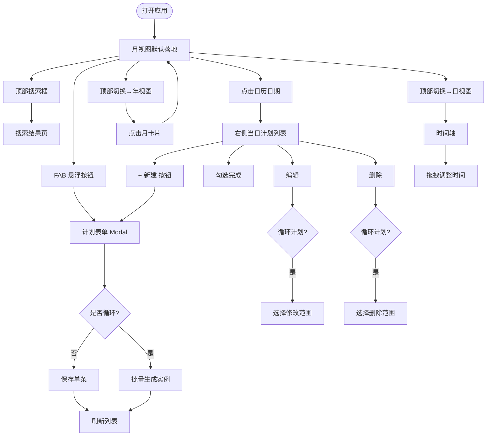
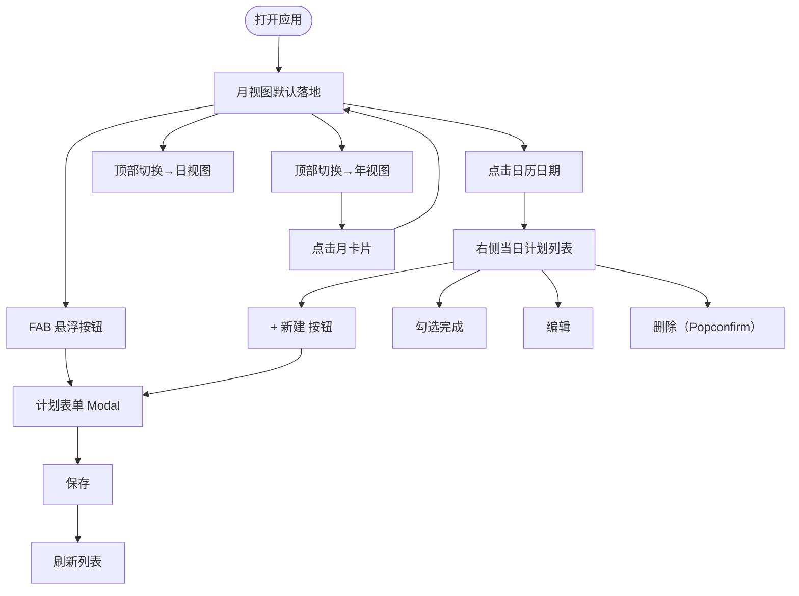

# 产品设计说明

## 1. 产品定位

面向个人用户的轻量日程计划管理工具。解决现有日历类应用操作繁重、备忘录类应用缺少时间维度的问题，提供年 / 月 / 日三级视图，让用户既能纵览全年执行进度，又能精确安排某天的时间段计划。

## 2. 用户与角色

| 角色 | 目标 | 关注点 | 典型操作 |
|---|---|---|---|
| 个人用户 | 管理日常计划，追踪完成情况 | 创建快捷、查看直观、移动端可用 | 新建计划、勾选完成、按月 / 日浏览 |

## 3. 核心场景

### 场景 1：快速记录今日计划

- **用户**：个人用户
- **背景**：早上打开应用，想快速把今天要做的事记下来
- **目标**：30 秒内完成创建
- **关键流程**：进入月视图 → 点击今天日期或 FAB → 填写标题（可选时间段、标签、优先级）→ 保存
- **成功标准**：计划出现在右侧列表和日视图时间轴上

### 场景 2：回顾本月执行情况

- **用户**：个人用户
- **背景**：月末想了解这个月计划的整体完成情况
- **目标**：快速看到完成率
- **关键流程**：进入年视图 → 找到本月卡片 → 查看 done/total 和进度条
- **成功标准**：年视图 12 张月卡片准确展示统计数据，点击可跳转对应月视图

### 场景 3：安排某天的时间块

- **用户**：个人用户
- **背景**：需要把某天的会议和任务按时间顺序排好
- **目标**：在时间轴上直观看到全天安排，并能随时调整
- **关键流程**：进入日视图 → 新建计划时填写开始 / 结束时间 → 计划渲染到时间轴对应位置 → 拖拽调整时间
- **成功标准**：有时间段的计划按时间排列在轴上，今天显示红色当前时间线；拖拽后时间自动保存

### 场景 4：设置每周固定任务

- **用户**：个人用户
- **背景**：每周一三五需要晨跑，想一次性设置好
- **目标**：批量创建循环计划，各天完成状态独立
- **关键流程**：新建计划 → 选择「每周」重复 → 勾选周一三五 → 设置结束日期 → 保存
- **成功标准**：日历上对应日期均有点标记；每天晨跑可单独勾选完成，不影响其他天

### 场景 5：移动端随时查看

- **用户**：个人用户
- **背景**：在手机上打开应用，查看今天的计划
- **目标**：移动端布局不错乱，操作顺畅
- **关键流程**：手机浏览器访问 → 月视图显示日期分组列表 → 点击计划可编辑
- **成功标准**：<768px 时布局切换为移动模式，表单 Modal 全屏，FAB 不遮挡内容

## 4. 核心对象抽象

| 对象 | 说明 | 为什么重要 |
|---|---|---|
| 计划（Plan） | 核心数据单元，含标题、日期、时间段、标签、完成状态、优先级、循环信息 | 所有视图和操作的基础 |
| 标签（Tag） | 对计划分类，支持预置 + 自定义 | 快速筛选和识别计划性质 |
| 视图（View） | 年 / 月 / 日三种聚合维度 | 不同粒度满足不同决策需求 |
| 循环组（RecurrenceGroup） | 同一循环计划的所有实例共享 group_id | 支持范围编辑 / 删除 |

## 5. 产品主流程

## 6. 页面设计

| 页面 | 目标 | 主要信息 | 关键操作 |
|---|---|---|---|
| 年视图 | 纵览全年执行进度 | 12 个月卡片：月份名、done/total、进度条 | 点击月卡片跳转月视图；左右箭头切年 |
| 月视图（桌面） | 按日历浏览和管理计划 | 左：Ant Design Calendar（有计划的日期显示圆点）；右：当日计划列表 | 点击日期更新右侧列表；+ 新建；左右切月 |
| 月视图（移动） | 移动端浏览本月所有计划 | 月份选择器 + 按日期分组的计划列表 | 切换月份；展开查看；FAB 新建 |
| 日视图 | 精确管理某天时间安排 | 时间轴（有时间段计划，可拖拽）+ 全天区域（无时间段） | 新建（含时间段）；勾选；编辑；删除；拖拽移时；标题点击返回月视图 |
| 计划表单 | 创建 / 编辑计划 | 标题、日期、开始 / 结束时间、标签、优先级；新建时可选循环类型 | 保存、取消；自定义添加标签 |
| 搜索结果页 | 按关键词查找计划 | 匹配计划列表，按日期分组 | 编辑；删除；勾选完成 |

## 7. 关键设计取舍

**三级视图的必要性**：年视图只做统计不做编辑，避免信息过载；月视图是主操作入口；日视图专注时间管理。三级分工清晰，避免单一视图过于复杂。

**循环计划提前批量生成**：批量生成而非动态展开，优点是各实例独立（可单独修改完成状态、时间），缺点是修改循环规则只能通过范围更新。与闹钟式动态展开相比，更符合「计划已定」的使用心理。

**优先级不做排序过滤**：优先级仅作视觉区分（色条），不改变列表顺序（仍按完成状态 + 时间排序）。避免引入复杂的排序偏好设置。

**拖拽仅在日视图时间轴**：全天计划和月视图计划不支持拖拽，原因是拖拽改日期的语义比改时间更重，容易误操作。日视图时间轴的拖拽局限于垂直方向，不允许跨天。

**搜索不做实时过滤**：搜索跳转独立结果页，而非在当前视图内过滤，原因是三个视图的结构差异较大，统一过滤层会增加大量复杂度；结果页更利于展示跨月计划。

**标签不做过滤**：当前版本标签仅作标注展示，不支持跨视图过滤。理由是单用户场景下计划总量有限，过滤收益低，优先保证核心流程完整。

**不引入账户系统**：本地 SQLite 单用户，不引入登录 / 注册。降低部署复杂度，专注于计划管理本身的交互设计。

**状态只有两态**：完成 / 未完成，不做进行中、暂停等多态。符合个人计划管理的实际使用习惯，简化 UI 复杂度。

**移动端月视图切换布局而非缩小**：日历在小屏上可读性极差，因此移动端直接换成日期分组列表，而不是强行压缩日历。

## 1. 产品定位

面向个人用户的轻量日程计划管理工具。解决现有日历类应用操作繁重、备忘录类应用缺少时间维度的问题，提供年 / 月 / 日三级视图，让用户既能纵览全年执行进度，又能精确安排某天的时间段计划。

## 2. 用户与角色

| 角色 | 目标 | 关注点 | 典型操作 |
|---|---|---|---|
| 个人用户 | 管理日常计划，追踪完成情况 | 创建快捷、查看直观、移动端可用 | 新建计划、勾选完成、按月 / 日浏览 |

## 3. 核心场景

### 场景 1：快速记录今日计划

- **用户**：个人用户
- **背景**：早上打开应用，想快速把今天要做的事记下来
- **目标**：30 秒内完成创建
- **关键流程**：进入月视图 → 点击今天日期或 FAB → 填写标题（可选时间段和标签）→ 保存
- **成功标准**：计划出现在右侧列表和日视图时间轴上

### 场景 2：回顾本月执行情况

- **用户**：个人用户
- **背景**：月末想了解这个月计划的整体完成情况
- **目标**：快速看到完成率
- **关键流程**：进入年视图 → 找到本月卡片 → 查看 done/total 和进度条
- **成功标准**：年视图 12 张月卡片准确展示统计数据，点击可跳转对应月视图

### 场景 3：安排某天的时间块

- **用户**：个人用户
- **背景**：需要把某天的会议和任务按时间顺序排好
- **目标**：在时间轴上直观看到全天安排
- **关键流程**：进入日视图 → 新建计划时填写开始 / 结束时间 → 计划渲染到时间轴对应位置
- **成功标准**：有时间段的计划按时间排列在轴上，今天显示红色当前时间线

### 场景 4：移动端随时查看

- **用户**：个人用户
- **背景**：在手机上打开应用，查看今天的计划
- **目标**：移动端布局不错乱，操作顺畅
- **关键流程**：手机浏览器访问 → 月视图显示日期分组列表 → 点击计划可编辑
- **成功标准**：<768px 时布局切换为移动模式，表单 Modal 全屏，FAB 不遮挡内容

## 4. 核心对象抽象

| 对象 | 说明 | 为什么重要 |
|---|---|---|
| 计划（Plan） | 核心数据单元，含标题、日期、时间段、标签、完成状态 | 所有视图和操作的基础 |
| 标签（Tag） | 对计划分类，支持预置 + 自定义 | 快速筛选和识别计划性质 |
| 视图（View） | 年 / 月 / 日三种聚合维度 | 不同粒度满足不同决策需求 |

## 5. 产品主流程

## 6. 页面设计

| 页面 | 目标 | 主要信息 | 关键操作 |
|---|---|---|---|
| 年视图 | 纵览全年执行进度 | 12 个月卡片：月份名、done/total、进度条 | 点击月卡片跳转月视图；左右箭头切年 |
| 月视图（桌面） | 按日历浏览和管理计划 | 左：Ant Design Calendar；右：当日计划列表 | 点击日期更新右侧列表；+ 新建；左右切月 |
| 月视图（移动） | 移动端浏览本月所有计划 | 月份选择器 + 按日期分组的计划列表 | 切换月份；展开查看；FAB 新建 |
| 日视图 | 精确管理某天时间安排 | 时间轴（有时间段计划）+ 全天区域（无时间段） | 新建（含时间段）；勾选；编辑；删除；标题点击返回月视图 |
| 计划表单 | 创建 / 编辑计划 | 标题、日期、开始 / 结束时间、标签选择 | 保存、取消；自定义添加标签 |

## 7. 关键设计取舍

**三级视图的必要性**：年视图只做统计不做编辑，避免信息过载；月视图是主操作入口；日视图专注时间管理。三级分工清晰，避免单一视图过于复杂。

**标签不做过滤**：当前版本标签仅作标注展示，不支持跨视图过滤。理由是单用户场景下计划总量有限，过滤收益低，优先保证核心流程完整。

**不引入账户系统**：本地 SQLite 单用户，不引入登录 / 注册。降低部署复杂度，专注于计划管理本身的交互设计。

**状态只有两态**：完成 / 未完成，不做进行中、暂停等多态。符合个人计划管理的实际使用习惯，简化 UI 复杂度。

**移动端月视图切换布局而非缩小**：日历在小屏上可读性极差，因此移动端直接换成日期分组列表，而不是强行压缩日历。
