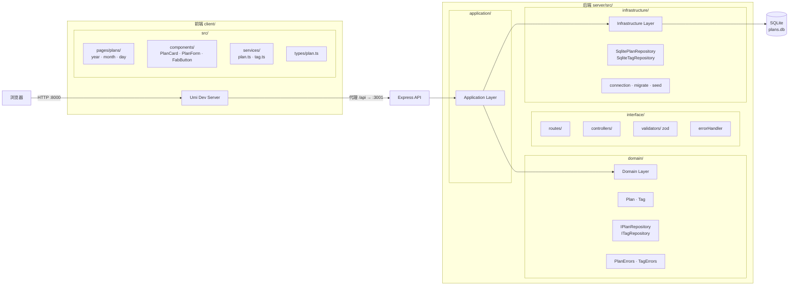
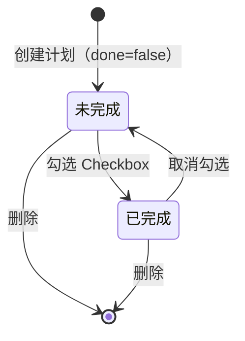
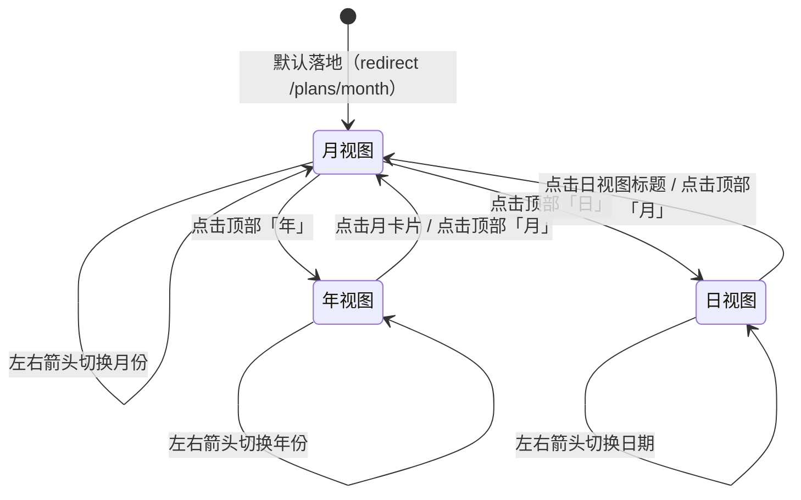

# 技术设计说明

## 1. 技术栈选择

| 类型 | 技术 | 选择原因 |
|---|---|---|
| 前端框架 | Umi 4 + React 18 | 约定式路由、内置代理、@/ 别名开箱即用；React 18 并发特性为后续扩展留空间 |
| 前端 UI | Ant Design 5 | 组件丰富（Calendar、TimePicker、Popconfirm），移动端适配成熟 |
| 前端样式 | CSS Modules + Less | 避免全局污染；Less 变量支持响应式断点统一管理 |
| 后端框架 | Express 4 | 轻量、生态成熟，适合单体小型 API 服务 |
| 数据库 | SQLite（better-sqlite3） | 零配置、本地文件、无需单独部署；WAL 模式支持并发读 |
| 运行时类型校验 | zod | Schema 即文档，错误信息结构化，与 TypeScript 类型无缝集成 |
| 包管理 | pnpm | 前后端统一；磁盘占用小，安装速度快 |

## 2. 架构设计



## 3. 数据模型

| 对象 | 关键字段 | 说明 |
|---|---|---|
| plans | id, title, date, start_time, end_time, tags, done, created_at, updated_at | tags 存为 JSON 字符串；done 存为 INTEGER 0/1；date 格式 YYYY-MM-DD |
| tags | id, name, is_preset | is_preset=1 为预置标签（工作/学习/健身/生活/其他），不可删除 |

```sql
CREATE TABLE plans (
  id         INTEGER PRIMARY KEY AUTOINCREMENT,
  title      TEXT    NOT NULL,
  date       TEXT    NOT NULL,
  start_time TEXT,
  end_time   TEXT,
  tags       TEXT,
  done       INTEGER NOT NULL DEFAULT 0,
  created_at TEXT    NOT NULL DEFAULT (datetime('now','localtime')),
  updated_at TEXT    NOT NULL DEFAULT (datetime('now','localtime'))
);
CREATE INDEX idx_plans_date ON plans(date);
CREATE INDEX idx_plans_date_done ON plans(date, done);

CREATE TABLE tags (
  id        INTEGER PRIMARY KEY AUTOINCREMENT,
  name      TEXT    NOT NULL UNIQUE,
  is_preset INTEGER NOT NULL DEFAULT 0
);
```

## 4. 接口 / 模块设计

| 模块 / 接口 | 职责 | 输入 | 输出 |
|---|---|---|---|
| GET /api/plans | 按视图查询计划 | view=year\|month\|day, date=对应格式 | year: YearSummary[]; month/day: Plan[] |
| POST /api/plans | 创建计划 | { title, date, start_time?, end_time?, tags?, done? } | Plan |
| PUT /api/plans/:id | 更新计划 | 同上（均可选） | Plan |
| DELETE /api/plans/:id | 删除计划 | path param: id | { id } |
| GET /api/tags | 获取全部标签 | — | Tag[] |
| POST /api/tags | 创建自定义标签 | { name } | Tag |
| DELETE /api/tags/:id | 删除自定义标签 | path param: id | { id } |
| PlanService | 编排计划业务逻辑 | 调用 IPlanRepository | Plan / YearSummary[] |
| TagService | 编排标签业务逻辑 | 调用 ITagRepository | Tag |
| SqlitePlanRepository | SQLite 计划数据访问 | Plan DTO | Plan（含类型转换） |
| SqliteTagRepository | SQLite 标签数据访问 | Tag DTO | Tag |

统一响应格式：
```json
{ "success": true, "data": T }
{ "success": false, "error": { "code": "ERROR_CODE", "message": "..." } }
```

## 5. 状态流转设计

### 计划完成状态



### 视图导航状态



## 6. 关键业务规则实现

**tags 序列化**：仅在 `SqlitePlanRepository.rowToPlan()` 中执行 `JSON.parse(tags ?? '[]')`，写入时 `JSON.stringify(tags)`。Service 层和 Controller 层始终处理 `string[]`，不感知存储格式。

**done 转换**：`rowToPlan()` 中 `done: row.done === 1`，写入时 `done: dto.done ? 1 : 0`。同样封装在 Repository 层。

**updated_at 手动维护**：SQLite 无自动触发器，每条 UPDATE 语句末尾追加 `SET updated_at = datetime('now','localtime')`。

**年视图查询**：使用 `GROUP BY substr(date, 1, 7)` 聚合统计，返回 `{ month, total, done }[]`，不返回计划记录列表。

**依赖注入**：`interface/app.ts` 中手动实例化 Repository → Service → Controller，通过构造函数传入，无需 IoC 框架。

## 7. 错误处理与边界处理

| 场景 | 处理方式 |
|---|---|
| zod 校验失败 | errorHandler 捕获 ZodError，返回 400 + INVALID_PARAM |
| 计划 / 标签不存在 | 抛出 PlanNotFoundError / TagNotFoundError，返回 404 + 对应 code |
| 标签重复 | 抛出 TagAlreadyExistsError，返回 409 + TAG_ALREADY_EXISTS |
| 删除预置标签 | 抛出 TagPresetReadonlyError，返回 403 + TAG_PRESET_READONLY |
| 未捕获异常 | errorHandler fallback，返回 500 + INTERNAL_ERROR |
| 前端请求失败 | `message.error` 提示，表单保留用户输入；列表页展示 Result 组件 + 重试按钮 |
| data 目录不存在 | `connection.ts` 中 `fs.mkdirSync(path.dirname(DB_PATH), { recursive: true })` 首次自动创建 |

## 8. AI 参与技术设计的情况

- **DDD 四层架构方案**：由 AI 提议，人确认采纳。主要考量是 better-sqlite3 细节（JSON 序列化、0/1 转换）完全隔离在 Repository 层，Service 层干净。
- **zod 校验位置**：AI 建议放在 interface 层的 validator 文件中，人确认合理。
- **手动 DI vs IoC 框架**：AI 建议手动 DI（在 app.ts 中集中连线），人确认采纳。项目规模小，引入 tsyringe 等框架增加不必要复杂度。
- **代理目标 localhost → 127.0.0.1**：AI 诊断出 nvm-windows 旧进程占用 IPv6 loopback 导致代理 404，提出修改方案，人采纳。
